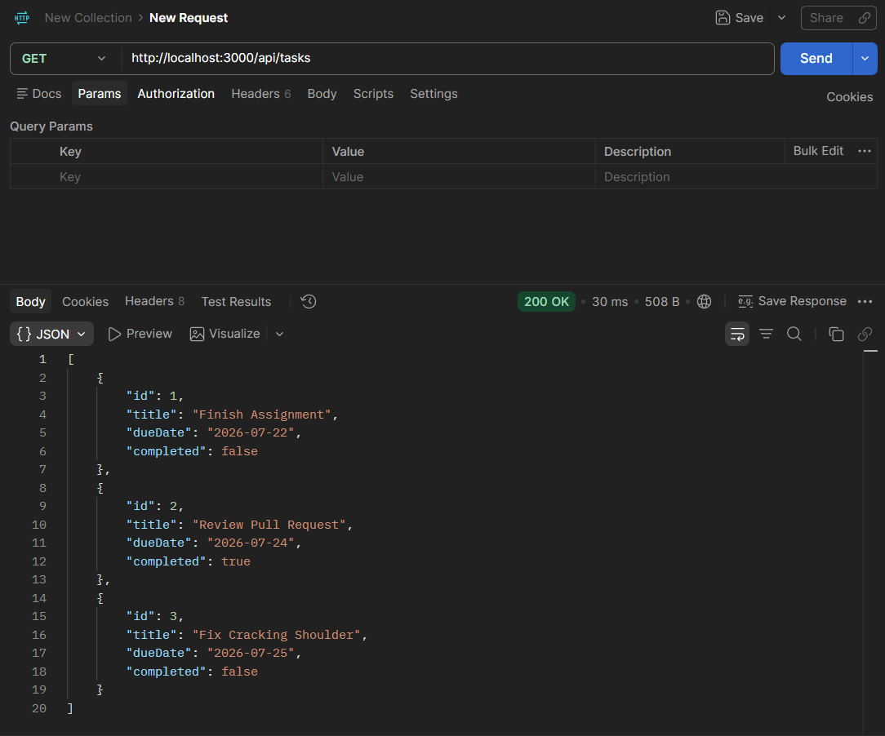
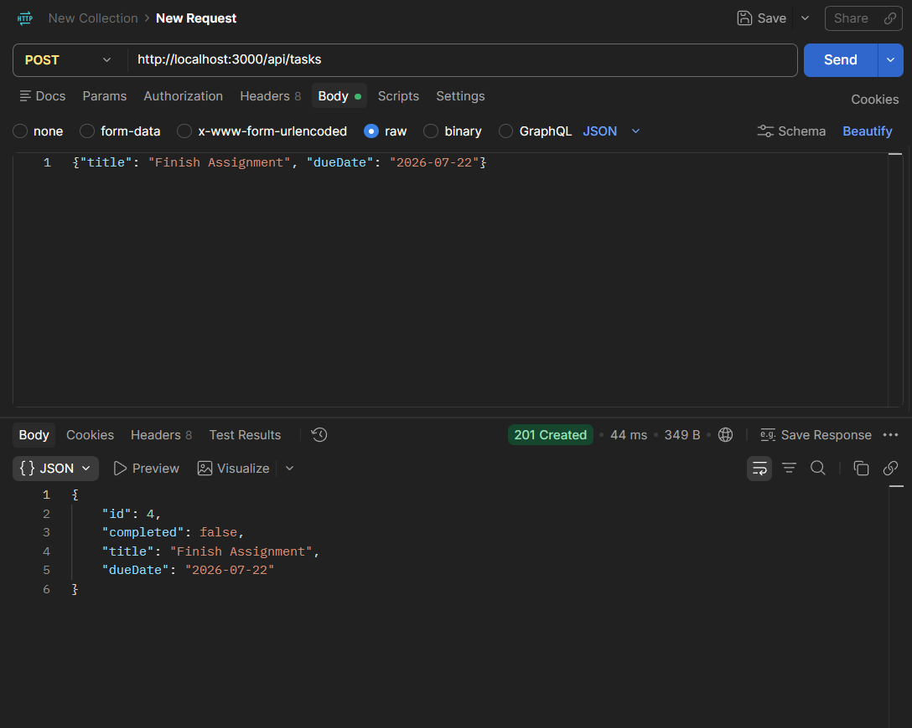
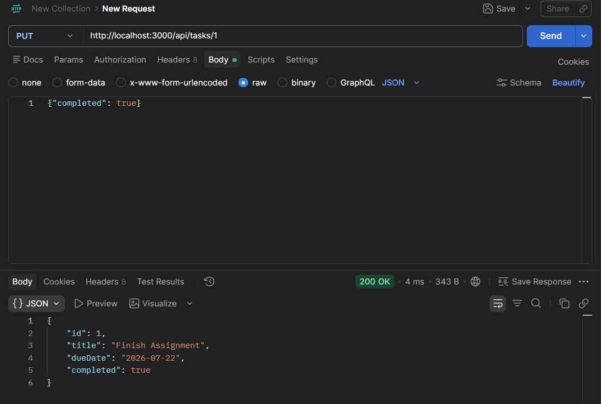
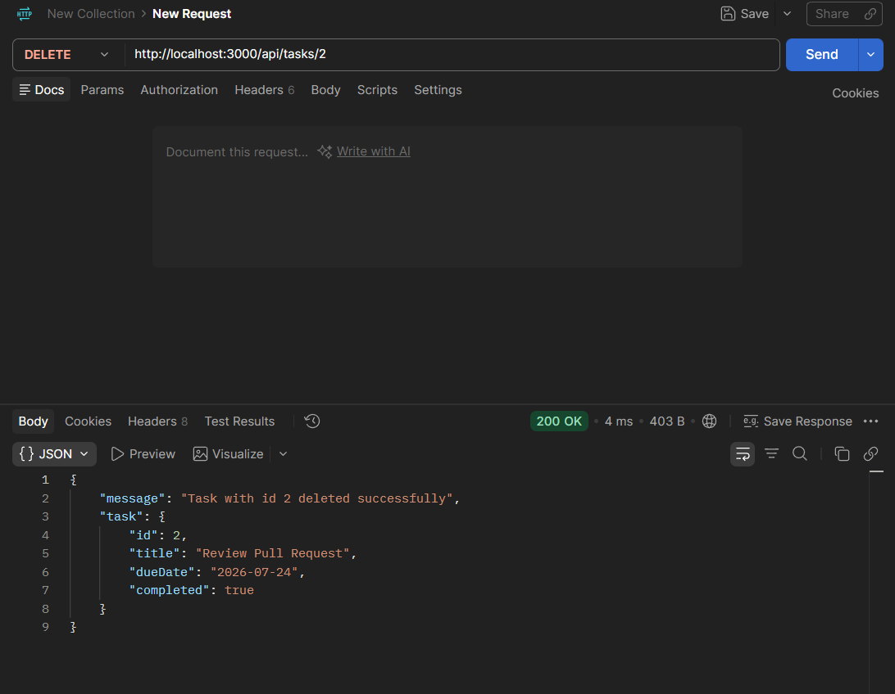
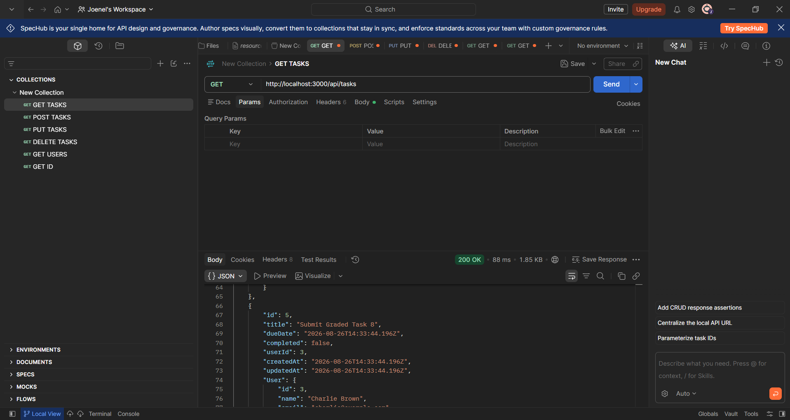
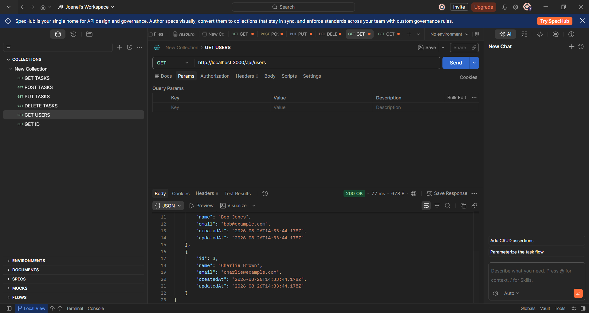
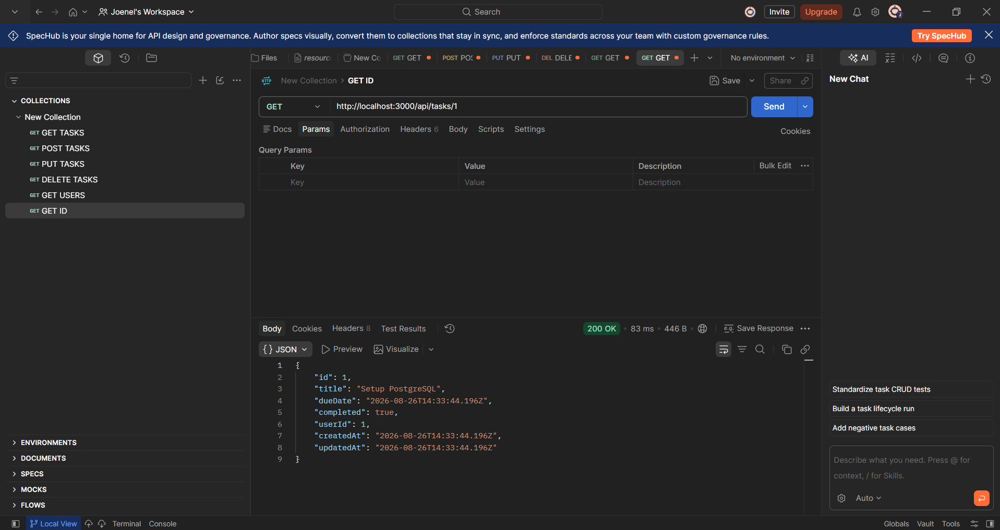
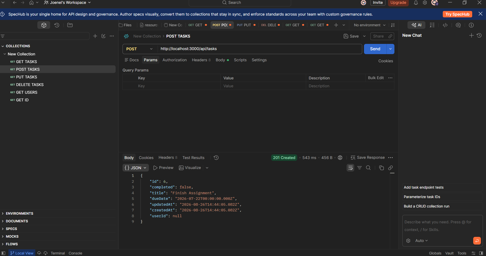
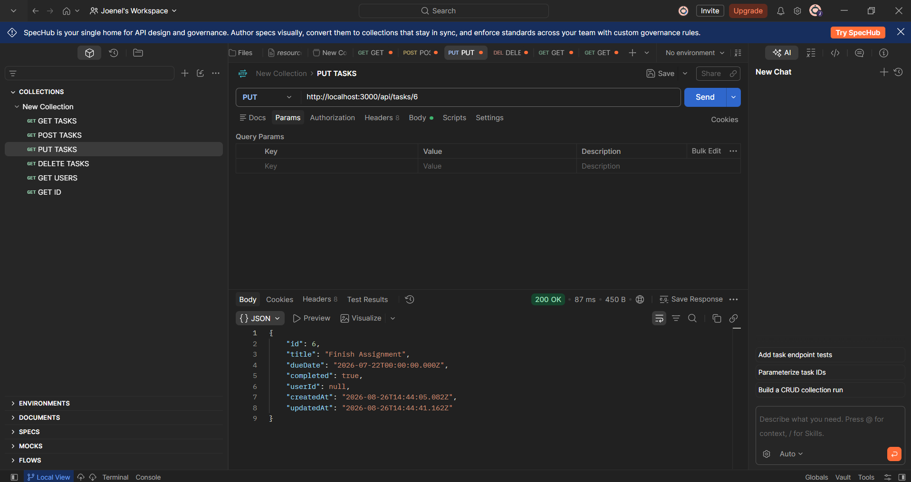
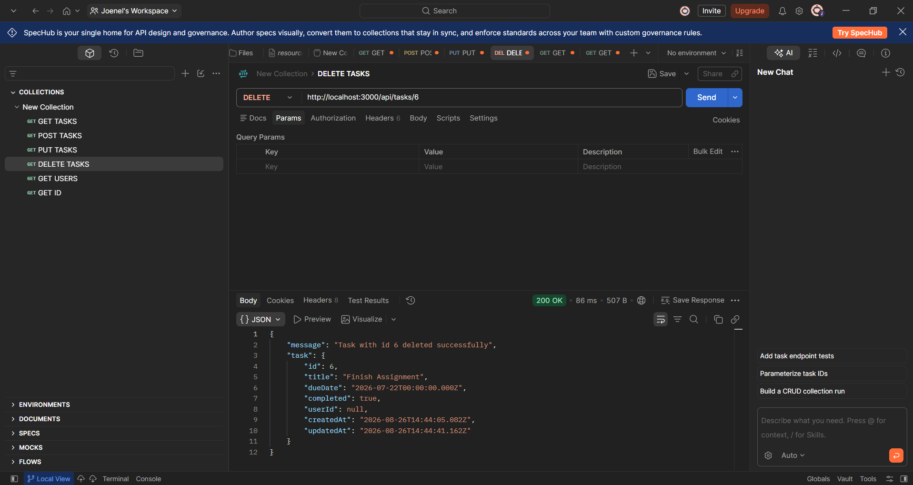

# itelect2-project
My IT Elective 2 backend web development project.

## API Testing

#### GET

#### POST 

#### PUT

#### DELETE

## Graded Task 8

#### GET /tasks

#### GET /users

#### GET /tasks/id

#### POST /tasks

#### PUT /tasks

#### DELETE /tasks
